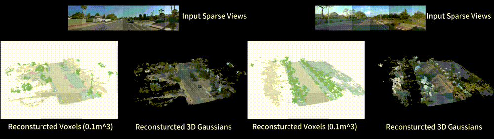

# SCube

<div align="center">
  
</div>

**SCube: Instant Large-Scale Scene Reconstruction using VoxSplats**<br>
[Xuanchi Ren](https://xuanchiren.com/)$^* $, [Yifan Lu](https://yifanlu0227.github.io/)$^* $, [Hanxue Liang](https://scholar.google.com/citations?user=XcxDA14AAAAJ&hl=en), [Zhangjie Wu](https://zhangjiewu.github.io/), [Huan Ling](http://www.cs.toronto.edu/~linghuan/), [Mike Chen](https://www.linkedin.com/in/nvidia-mikechen/), [Sanja Fidler](https://www.cs.utoronto.ca/~fidler/), [Francis Williams](https://www.fwilliams.info/), [Jiahui Huang](https://huangjh-pub.github.io/) <br>
\* indicates equal contribution <br>
**[[Project Page]](https://research.nvidia.com/labs/toronto-ai/scube/)**


## Installation
<p align="center">:construction: :pick: :hammer_and_wrench: :construction_worker:</p>
<p align="center">Under construction. Stay tuned!</p>

## Related Works

- Ren et al. 2024. [XCube: Large-Scale 3D Generative Modeling using Sparse Voxel Hierarchies](https://research.nvidia.com/labs/toronto-ai/xcube).
- Williams et al. 2024. [𝑓VDB: A Deep-Learning Framework for Sparse, Large-Scale, and High-Performance Spatial Intelligence](https://arxiv.org/abs/2407.01781).

## Acknowledgement

This repo is based on https://github.com/nv-tlabs/XCube.

## Citation
```
@inproceedings{
    ren2024scube,
    title={SCube: Instant Large-Scale Scene Reconstruction using VoxSplats},
    author={Ren, Xuanchi and Lu, Yifan and Liang, Hanxue and Wu, Jay Zhangjie and Ling, Huan and Chen, Mike and Fidler, Sanja annd Williams, Francis and Huang, Jiahui},
    booktitle={The Thirty-eighth Annual Conference on Neural Information Processing Systems},
    year={2024},
}
```
