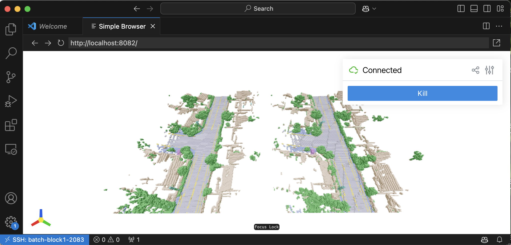
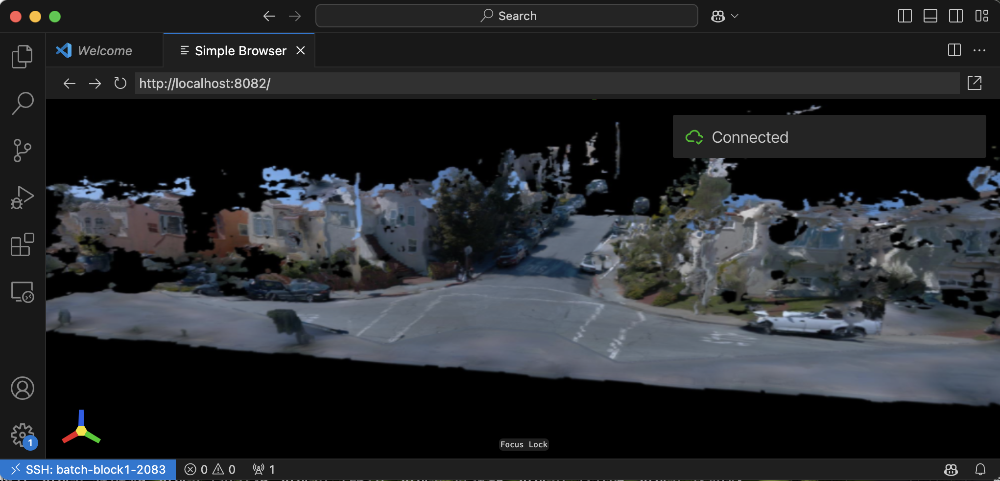

# SCube: Instant Large-Scale Scene Reconstruction using VoxSplats

<div align="center">
  
</div>

**SCube: Instant Large-Scale Scene Reconstruction using VoxSplats**<br>
[Xuanchi Ren](https://xuanchiren.com/)$^* $, [Yifan Lu](https://yifanlu0227.github.io/)$^* $, [Hanxue Liang](https://scholar.google.com/citations?user=XcxDA14AAAAJ&hl=en), [Zhangjie Wu](https://zhangjiewu.github.io/), [Huan Ling](http://www.cs.toronto.edu/~linghuan/), [Mike Chen](https://www.linkedin.com/in/nvidia-mikechen/), [Sanja Fidler](https://www.cs.utoronto.ca/~fidler/), [Francis Williams](https://www.fwilliams.info/), [Jiahui Huang](https://huangjh-pub.github.io/) <br>
\* indicates equal contribution <br>
**[[Project Page]](https://research.nvidia.com/labs/toronto-ai/scube/)**

## News
- 2024-12-11: Also check out our latest research [InfiniCube](https://research.nvidia.com/labs/toronto-ai/infinicube/).
- 2024-12-11: Code released! We have also integrated [XCube](https://research.nvidia.com/labs/toronto-ai/xcube/) into this repository for easier use. For detailed instructions, please refer to the [XCube Instruction](XCUBE.md).

## Installation
```bash
mkdir SCube-release # wrap it in a folder
cd SCube-release
git clone https://github.com/nv-tlabs/SCube.git 
mkdir wandb
mkdir waymo_tfrecords 
cd SCube
```

**(Optional) Install libMamba for a huge quality of life improvement when using Conda**
```bash
conda update -n base conda
conda install -n base conda-libmamba-solver
conda config --set solver libmamba
```

**Install the conda environment**
```bash
conda env create -f environment.yml
conda activate scube
mim install "mmcv>=2.0.0"
pip install "mmsegmentation>=1.0.0"
```

### Setup WandB
Our training script highly relies on [WandB](https://wandb.ai/). Please register an account for [WandB](https://wandb.ai/) first and get your `API_key`. Then you can setup for your machine by running this command in the terminal:
```bash
wandb login # requires your API key
```

## Data Preparation

### Data Split Downloading
First download our splits of waymo dataset.
```bash
gdown https://drive.google.com/drive/folders/1d8V4aoHsDf5U0-SH_VY2MOZJdYvOG8TM -O ../waymo_split --folder
```

### Waymo Dataset Downloading
Download the all the training & validation clips from [waymo perception dataset v1.4.2](https://waymo.com/open/download/) to the `SCube-release/waymo_tfrecords`. 

If you have `sudo`, you can use [gcloud](https://cloud.google.com/storage/docs/discover-object-storage-gcloud) to download them from terminal.
<details>
<summary><span style="font-weight: bold;">gcloud installation (need sudo) and downloading from terminal</span></summary>

```bash
sudo apt-get update
sudo apt-get install apt-transport-https ca-certificates gnupg curl
curl https://packages.cloud.google.com/apt/doc/apt-key.gpg | sudo gpg --dearmor -o /usr/share/keyrings/cloud.google.gpg
echo "deb [signed-by=/usr/share/keyrings/cloud.google.gpg] https://packages.cloud.google.com/apt cloud-sdk main" | sudo tee -a /etc/apt/sources.list.d/google-cloud-sdk.list
sudo apt-get update && sudo apt-get install google-cloud-cli
```

Then you can login your google account and download the above tfrecords via
```bash
# or use `gcloud init --no-launch-browser` if you are in a remote terminal session
gcloud init 
bash datagen/download_waymo.sh datagen/waymo_all.json ../waymo_tfrecords
```
</details>

After downloading tfrecord files, we expect a folder structure as follows:
```bash
SCube-release
|-- SCube
|   `-- ...
|-- waymo_split
|   `-- ...
`-- waymo_tfrecords
    |-- segment-10247954040621004675_2180_000_2200_000_with_camera_labels.tfrecord
    |-- segment-11379226583756500423_6230_810_6250_810_with_camera_labels.tfrecord
    |-- ...
    `-- segment-1172406780360799916_1660_000_1680_000_with_camera_labels.tfrecord
```

> [!NOTE]
> If you download the tfrecord files from the console, you will have prefixes like `individual_files_training_` or `individual_files_validation_`. Make sure these prefixes are removed before further processing.

### Data Processing
We first extract the image, LiDAR, pose, intrinsic, annotation files out of tfrecords, which will be saved in `../waymo_ns`. If you have multiple CPU cores, you can set `--num_workers` to your core number for parallelization. 
```bash
python datagen/waymo2nerfstudio.py -i ../waymo_tfrecords -o ../waymo_ns [--num_workers YOUR_CPU_CORE]
```

We then process the raw data into webdataset format required by SCube training while infering SegFormer for sky mask and Metric3Dv2 for GT depth. The results will be saved in `../waymo_webdataset`. Note that this step is very time-comsuming for 1000 clips x 198 frames x 5 cameras, which can take over 1 day on 8x A100 GPUs. 
> [!NOTE]
> You might encounter `AssertionError: MMCV==2.2.0 is used but incompatible. Please install mmcv>=2.0.0rc4.` when using mmcv. [Solution here](https://github.com/open-mmlab/mmsegmentation/issues/3729#issuecomment-2225475821).

> [!NOTE]
> You might encounter `RuntimeError: Failed to find function: mono.model.backbones.vit_large_reg` when using Metric3D v2. [Solution here](https://github.com/YvanYin/Metric3D/issues/151#issuecomment-2333039827)

```bash
# single GPU
python datagen/nerfstudio2webdataset.py -i ../waymo_ns -o ../waymo_webdataset

# multiple GPU
torchrun --nnodes=1 --nproc-per-node=8 'datagen/nerfstudio2webdataset.py' -i ../waymo_ns -o ../waymo_webdataset
```

Now the `../waymo_ns` and `../waymo_tfrecords` will not be used anymore. We expect the folder structure like:
```bash
SCube-release
|-- SCube
|   `-- ...
|-- waymo_split
|   `-- ...
`-- waymo_webdataset
    `-- ...
```

### GT Voxel Downloading
We provide the webdataset-format files of ground-truth voxels on [Hugging Face](https://huggingface.co/datasets/xrenaa/SCube-Data/tree/main/pc_voxelsize_01). Download and uncompress it in `SCube-release/waymo_webdataset` along with other attributes.

To visualize the ground-truth voxel data, which is stored in point cloud format, you can run the following command:

```bash
python inference/visualize_gt_pc.py -p <GT_VOXEL_TAR_FILE>
```

## Model Training
### VAE Training
```bash
# Coarse stage VAE
python train.py configs/waymo_scube/train_vae_64x64x64_dense_height_down2_residual.yaml --wname train_vae_64x64x64_dense_height_down2_residual --max_epochs 10 --gpus 8 --eval_interval 1

# Fine stage VAE
python train.py configs/waymo_scube/train_vae_256x256x128_sparse.yaml --wname train_vae_256x256x128_sparse --max_epochs 10 --gpus 8 --eval_interval 1
```

### Geometry Reconstruction Training (Latent Voxel Diffusion Model)

> [!IMPORTANT]  
> You need to modify the `vae_checkpoint` in `configs/waymo_scube/train_diffusion_64x64x64_image_cond.yaml` and `configs/waymo_scube/train_diffusion_256x256x128_sparse.yaml` to your own experiments. In you wandb webpage, you can find a unique "run id" for your experiment and replace the `[YOUR_RUN_ID]` in the yaml file.

```bash
# Image conditioned voxel diffusion
python train.py configs/waymo_scube/train_diffusion_64x64x64_image_cond.yaml --wname train_diffusion_64x64x64_image_cond --max_epochs 40 --gpus 8 --eval_interval 1

# Semantic conditioned upsampling voxel diffusion
python train.py configs/waymo_scube/train_diffusion_256x256x128_sparse.yaml --wname train_diffusion_256x256x128_sparse --max_epochs 20 --gpus 8 --eval_interval 1
```

### Appearance Reconstruction Training (GSM, *G*aussian *S*platting *M*odel)
```bash
python train.py configs/waymo_scube/train_gsm_unet3d_view3.yaml --wname train_gsm_unet3d_view3 --max_epochs 30 --gpus 8 --eval_interval 1
```

## Model Inference
**Inference VAE**
```bash
# replace nvidia-toronto to your own wandb account!
python inference/vae.py none --ckpt_vae wdb:nvidia-toronto/scube-scene-recon/waymo_wds/train_vae_64x64x64_dense_height_down2_residual
python inference/vae.py none --ckpt_vae wdb:nvidia-toronto/scube-scene-recon/waymo_wds/train_vae_256x256x128_sparse
```
This will generate a folder `../vae_output_waymo_wds/`, storing predicted & GT grid + semantics. Specify `--ckpt_vae` to the experiment name.

**Inference Diffusion**
```bash
# replace nvidia-toronto to your own wandb account!
python inference/diffusion.py none --use_ema --use_ddim --ddim_step 100 --ckpt_dm wdb:nvidia-toronto/scube-scene-recon/waymo_wds/train_diffusion_64x64x64_image_cond
python inference/diffusion.py none --use_ema --use_ddim --ddim_step 100 --ckpt_dm wdb:nvidia-toronto/scube-scene-recon/waymo_wds/train_diffusion_256x256x128_sparse
```
This will generate a folder `../diffusion_output_waymo_wds/`, storing predicted & GT voxel grid with semantics.
Specify `--ckpt_dm` to the experiment name.

**Inference GSM**
```bash
# replace nvidia-toronto to your own wandb account!
python inference/gaussian_feedforward.py none --ckpt_gsm wdb:nvidia-toronto/scube-scene-recon/waymo_wds/train_gsm_unet3d_view3 [--save_gs]
```
This will generate a folder `../diffusion_output_waymo_wds/`, storing predicted & GT grid + semantics.
Specify `--ckpt_gsm` to the experiment name. Add `[--save_gs]` to save the 3D Gaussians.

**Inference Full Pipeline**
```bash
# replace nvidia-toronto to your own wandb account!
python inference/diffusion_cascading_gsm.py none \
    --use_ema --use_ddim --ddim_step 100 \
    --ckpt_dm_c wdb:nvidia-toronto/scube-scene-recon/waymo_wds/train_diffusion_64x64x64_image_cond \
    --ckpt_dm_f wdb:nvidia-toronto/scube-scene-recon/waymo_wds/train_diffusion_256x256x128_sparse \
    --ckpt_gsm wdb:nvidia-toronto/scube-scene-recon/waymo_wds/train_gsm_unet3d_view3 \
    --input_frame_offsets [0] \
    --sup_frame_offsets [0,5,10] \
    --split val \
    --val_starting_frame 0
```

## Visualize the Inference Result
**Visualize Grids**

<div align="center">
  
</div>

In `../vae_output_waymo_wds/` and `../diffusion_output_waymo_wds/` and `../cascading_diffusion_output_waymo_wds`, you can find some folders containing `x.pt` and `x_gt.pt`, where `x` is the sample index for your inference. Run the following command to launch a interactive visualizer (even on a remote-ssh machine) in a web browser.
```bash
python inference/visualize_grid_compare.py -p <PT_FILES_FOLDER> [-t voxel]
```

where `-t` is available for `voxel` or `pc`. Do not use `voxel` for the fine stage, which is very heavy for rendering. It would be easy to use it on a remote machine with VSCode; VSCode will forward the port automatically for you.

---
**Visualize 3DGS**

<div align="center">
  
</div>

In `../splat_output_waymo_wds` and `cascading_diffusion_output_waymo_wds`, you can find some folder containing `x_splat.pkl`, where `x` is the sample index for your inferenece. You can visualize the 3DGS with 
```bash 
python inference/visualize_3dgs_pkl.py -p <3DGS_PKL_FILE>
```
---
**Shortcut**

You could install this project to create short cut for visualization.
```bash
poetry install 
```
Then you will have command `vis-pair` equivalent to `python inference/visualize_grid_compare.py`, `vis-gs` equivalent to `python inference/visualize_3dgs_pkl.py` and `vis-gt-pc` equivalent to `inference/visualize_gt_pc.py`. You can run visualization as
```bash
vis-pair -p <PT_FILES_FOLDER>
vis-gs -p <3DGS_PKL_FILE>
vis-gt-pc -p <GT_VOXEL_TAR_FILE>
```

## License

Copyright &copy; 2024, NVIDIA Corporation & affiliates. All rights reserved.
This work is made available under the [Nvidia Source Code License](LICENSE.txt).

## Related Works
- Lu et al. 2024. [InfiniCube: Unbounded and Controllable Dynamic 3D Driving Scene Generation with World-Guided Video Models](https://research.nvidia.com/labs/toronto-ai/infinicube/).
- Ren et al. 2024. [XCube: Large-Scale 3D Generative Modeling using Sparse Voxel Hierarchies](https://research.nvidia.com/labs/toronto-ai/xcube).
- Williams et al. 2024. [𝑓VDB: A Deep-Learning Framework for Sparse, Large-Scale, and High-Performance Spatial Intelligence](https://arxiv.org/abs/2407.01781).

## Acknowledgement

This repo is based on https://github.com/nv-tlabs/XCube.

## Citation
```
@inproceedings{
    ren2024scube,
    title={SCube: Instant Large-Scale Scene Reconstruction using VoxSplats},
    author={Ren, Xuanchi and Lu, Yifan and Liang, Hanxue and Wu, Jay Zhangjie and Ling, Huan and Chen, Mike and Fidler, Sanja annd Williams, Francis and Huang, Jiahui},
    booktitle={The Thirty-eighth Annual Conference on Neural Information Processing Systems},
    year={2024},
}
```


